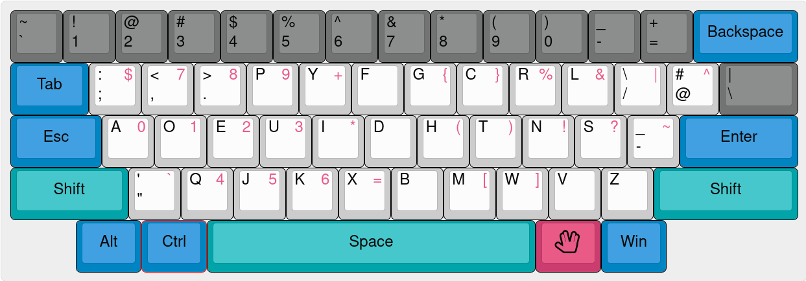

# Dvorak improved (DIM)
### works best with ["Russian Typewriter improved"](https://github.com/neuromagus/dvorak-improved/tree/main/linux/ru)


# Pros
- Convenient work in Vim, thanks to moving ```Esc``` and ```;```
- This layout removes the “Emacs pinkie”  and allows you to work comfortably, since the Modifiers are located as in the [original source.](https://upload.wikimedia.org/wikipedia/commons/thumb/4/47/Space-cadet.jpg/1920px-Space-cadet.jpg)
- Low distance travel, top row (gray buttons on image) are kept only for gaming
- Excellent for most types of programming languages and numeric input
- Excellent for every genre and type of text

## Windows install:

Download [windows/en/dim.zip](https://github.com/neuromagus/dvorak-improved/blob/main/windows/en/DIM.zip), extract, run the installer ```DIM_amd64.msi``` for 64bit or ```DIM_i386.msi``` for 32bit Windows.  
Next, download and install latest version of [Sharpkeys](https://github.com/randyrants/sharpkeys/releases)  
After the installation open the Sharpkeys tool, press the ```Load keys``` menu and choose file
```DIM-modificators-sharpkeys.skl``` in the extracted DIM folder.
Next, press the ```Write to Registry``` menu, close Sharpkeys and LOG OUT!

Well done, open the keyboard config and set the ```Dvorak improved``` to be default.

Enjoy ;}

## Linux install:

run the following commands to install console map and Xorg/Wayland layout:
    
    git clone https://github.com/neuromagus/dvorak-improved.git
    cd dvorak-improved/linux
    sudo make install

#### Activation for the VT console (add to /etc/vconsole.conf or similar):

    KEYMAP=dvorak-improved

#### Activation for the X11:

    setxkbmap -layout us -variant dim
    or
    setxkbmap -layout us,yoursecondlanguage -variant dim,yourlayoutforsecondlanguage

or add in /etc/X11/xorg.conf.d/00-keyboard.conf:

    Section "InputClass"
        Identifier "system-keyboard"
        MatchIsKeyboard "on"
        Option "XkbLayout" "us,yoursecondlanguage"
        Option "XkbModel" "pc104"
        Option "XkbVariant" "dim,yourlayoutforsecondlanguage"
        Option "XkbOptions" "grp:win_space_toggle"
    EndSection

#### Activation for the Sway or similar WM, based on Wlroots (add to ~/.config/sway/config):

    input "type:keyboard" {
        xkb_layout us,yoursecondlanguage
        xkb_variant dim,yourlayoutforsecondlanguage
        xkb_options grp:win_space_toggle
        repeat_delay 300
        repeat_rate 50
    }

#### Reinstall (whenever a system-wide XKB package upgrade reverts the installation):

    sudo make reinstall

#### Uninstall:

    sudo make uninstall

Enjoy ;}
