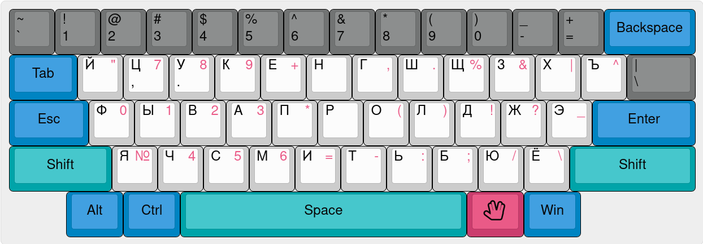

# Typewriter improved (RUTIM)

### works best with ["Dvorak improved"](https://github.com/neuromagus/dvorak-improved)

## Linux install:

    git clone https://github.com/neuromagus/dvorak-improved.git
    cd dvorak-improved/linux/ru
    sudo make install

#### Activation for the Xorg:

    setxkbmap -layout en,ru -variant dim,rutim

or add in /etc/X11/xorg.conf.d/00-keyboard.conf:

    Section "InputClass"
        Identifier "system-keyboard"
        MatchIsKeyboard "on"
        Option "XkbLayout" "us,ru"
        Option "XkbModel" "pc104"
        Option "XkbVariant" "dim,rutim"
        Option "XkbOptions" "grp:win_space_toggle"
    EndSection

#### Activation for the Sway or similar WM, based on Wlroots (add to ~/.config/sway/config):
 
    input "type:keyboard" {
        xkb_layout us,ru
        xkb_variant dim,rutim
        xkb_options grp:win_space_toggle
        repeat_delay 300
        repeat_rate 50
    }

#### Reinstall (whenever a system-wide XKB package upgrade reverts installation):

    sudo make reinstall

#### Uninstall:

    sudo make uninstall

Enjoy ;}
